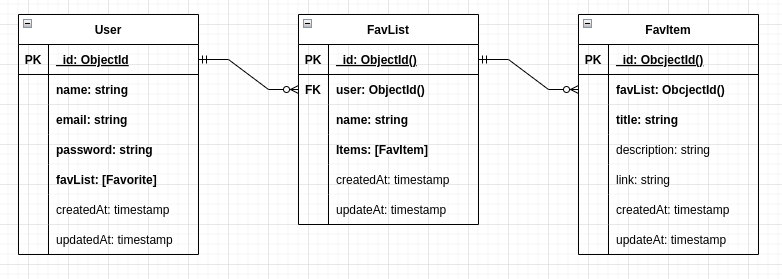

# Favs API

This is a favorites list managment project, build using typescript and persited in a non-relational database (MongoDB).

---

## Diagram Model

## Technologies

|                                                                                            |                                                                                                                     |
| ------------------------------------------------------------------------------------------ | ------------------------------------------------------------------------------------------------------------------- |
|              | [**Express**](https://github.com/expressjs/express) for create server.                                              |
|                                                                                            | [**cors**](https://github.com/expressjs/cors) for communication between servers.                                    |
|  | [**dotenv**](https://github.com/motdotla/dotenv) to create environment vars in node.                                |
|                                                                                            | [**morgan**](https://github.com/expressjs/morgan) to identify the requests to the server and seeing in the console. |
|   | [**mongoose**](https://mongoosejs.com/) to manage the database.                                                     |
|                                                                                            | [**bcrypt.js**](https://github.com/dcodeIO/bcrypt.js) for password encryption                                       |
|                                                                                            | [**jsonwebtoken**](https://github.com/auth0/node-jsonwebtoken) for creating an authentication token.                |
|                                                                                            | [**Jest**](https://jestjs.io/) for test code.                                                                       |
|                                                                                            | [**SuperTest**](https://github.com/visionmedia/supertest) to clone the server and test the routes.                  |
|                                                                                            | [**Swagger UI Express**](https://github.com/scottie1984/swagger-ui-express) to create the documentation interface   |
|                                                                                            | [**swagger-jsdoc**](https://github.com/Surnet/swagger-jsdoc) to retrive documentatión of routes from code           |

## Dev Technologies

|     |                                                                                                                            |
| --- | -------------------------------------------------------------------------------------------------------------------------- |
|     | [**TypeScript**](https://www.typescriptlang.org/) for writing TypeScript code                                              |
|     | [**ts-node-dev**](https://github.com/whitecolor/ts-node-dev) to mount a local server and observe the changes               |
|     | [**cross-env**](https://github.com/kentcdodds/cross-env) to create the jest sandbox                                        |
|     | [**ESLint**](https://eslint.org/) to examine the code.                                                                     |
|     | [**prettier**](https://prettier.io/) to format the code.                                                                   |
|     | [**husky**](https://github.com/typicode/husky) to ensure that the _eslint_ and _prettier_ rules are applied before commit. |

## Requirements

| Logo                                                                                                                                              | Name                                                         |
| ------------------------------------------------------------------------------------------------------------------------------------------------- | ------------------------------------------------------------ |
|                                                                       | [**Node**](https://nodejs.org/en/) _version 16.x_ o superior |
|  | [**MongoDB**](https://www.mongodb.com/)                      |

## Installation

1. Clone the repository to your local machine using the terminal `git clone https://github.com/Zuniga63/favs-api.git`
2. Install dependencies `npm install`
3. Create the file _.env_ using the command `cp .env.example .env`.
4. Enter enviroment settings.

   

### For Dev

Run the command `npm run dev`;

### To generate production build

Run the command `npm run build`

### To start server in production

Run the command `npm start` after last command.

## API Documentation

Swagger was used for the documentatión and can be seen in the route **http://localhost:8080/docs/**  
_alert:_ use the .env port.

## Testing

Jest is used to test the code. Tested the code up to about 80%.

## Password encryption

It is done on the model [**User**](src/models/User.model.ts) in the lines 54 to 73

;
