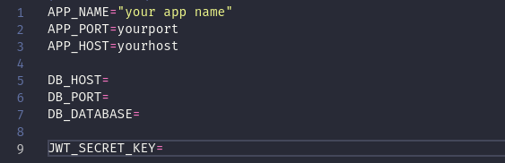
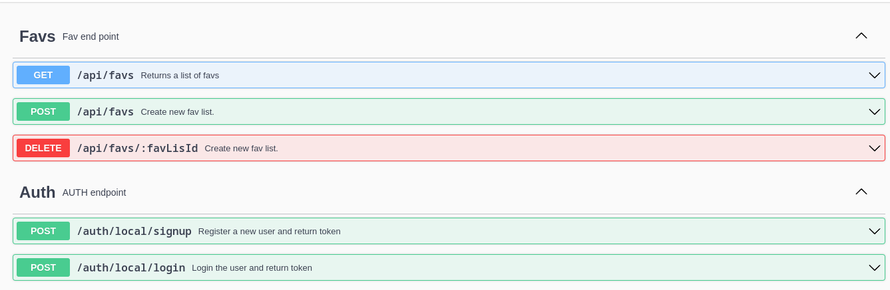
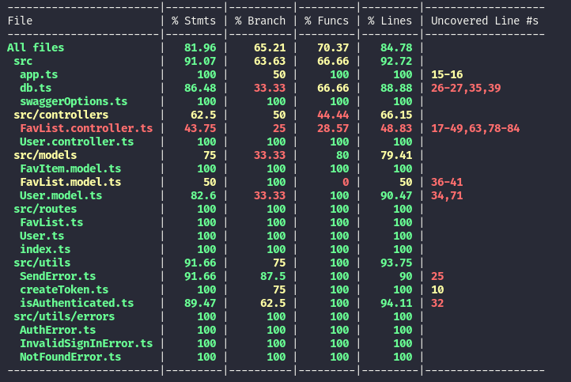
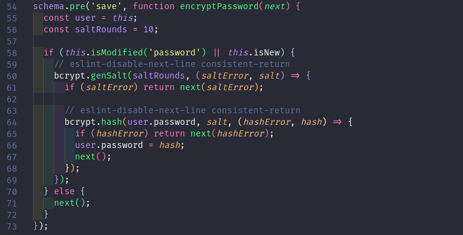

# Favs API

Este es un proyecto para la administración de listas de favoritos,
construido utilizando typescript y persistido en una base de datos no relacional (MongoDB).

---

## Tecnologías

|                                                                                            |                                                                                                                         |
| ------------------------------------------------------------------------------------------ | ----------------------------------------------------------------------------------------------------------------------- |
|              | [**Express**](https://github.com/expressjs/express) para el servidor                                                    |
|                                                                                            | [**cors**](https://github.com/expressjs/cors) para la comunicación entre servidores                                     |
|  | [**dotenv**](https://github.com/motdotla/dotenv) para las variables de entorno en node.                                 |
|                                                                                            | [**morgan**](https://github.com/expressjs/morgan) para identificar las peticiones al servidor y verlas en consola       |
|   | [**mongoose**](https://mongoosejs.com/) para administrar la base de datos                                               |
|                                                                                            | [**bcrypt.js**](https://github.com/dcodeIO/bcrypt.js) para la encriptación de las contraseñas.                          |
|                                                                                            | [**jsonwebtoken**](https://github.com/auth0/node-jsonwebtoken) para la creación de un token de authenticación           |
|                                                                                            | [**Jest**](https://jestjs.io/) para testear el codigo.                                                                  |
|                                                                                            | [**SuperTest**](https://github.com/visionmedia/supertest) para clonar el servidor y hacer pruebas en las rutas.         |
|                                                                                            | [**Swagger UI Express**](https://github.com/scottie1984/swagger-ui-express) para crear la interfaz de la documentación. |
|                                                                                            | [**swagger-jsdoc**](https://github.com/Surnet/swagger-jsdoc) para recuperar la documentación de las rutas               |

## Tecnologías para el desarrollo

|     |                                                                                                                                 |
| --- | ------------------------------------------------------------------------------------------------------------------------------- |
|     | [**TypeScript**](https://www.typescriptlang.org/) para la escritura del codigo JavaScript                                       |
|     | [**ts-node-dev**](https://github.com/whitecolor/ts-node-dev) para montar un servidor local y observar los cambios               |
|     | [**cross-env**](https://github.com/kentcdodds/cross-env) para crear el entrorno de pruebas de jest                              |
|     | [**ESLint**](https://eslint.org/) para examinar el coigo                                                                        |
|     | [**prettier**](https://prettier.io/) para formatear el codigo                                                                   |
|     | [**husky**](https://github.com/typicode/husky) para garantizar que se apliquen las reglas de _eslint_ y _prettier_ en el codigo |

## Requerimientos

| Logo                                                                                                                                              | Nombre                                                       |
| ------------------------------------------------------------------------------------------------------------------------------------------------- | ------------------------------------------------------------ |
|                                                                       | [**Node**](https://nodejs.org/en/) _version 16.x_ o superior |
|  | [**MongoDB**](https://www.mongodb.com/)                      |

## Instalación

1. Clonar el repositorio en su máquina local usando la terminal `git clone https://github.com/Zuniga63/favs-api.git`
2. Instalar las dependencias `npm install`
3. Crear el archivo \*_.env_ en .env `cp .env.example .env`
4. Ingresar las configuración de entorno

   

### Para Desarrollo

Ejecutar el comando `npm run dev`;

### Para generar build de producción

Ejecutar el comando `npm run build`

### Para iniciar el servidor en producción

Ejecutar el comando `npm start` despues del comando anterior.

## Documentación de la API

Para la documentación se utilizó Swagger y se puede ver en la ruta **http://localhost:8080/docs/**

## Testing

Para testear el codigo se utilizó Jest y se realizarón unas pruebas hasta alcanzar aproximadamente un 80%

## Encriptación de la contraseña

Se realiza en el modelo [**User**](src/models/User.model.ts) en la linea 54-73

;
